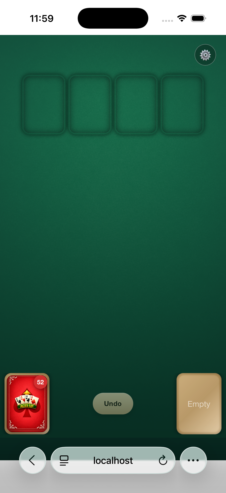
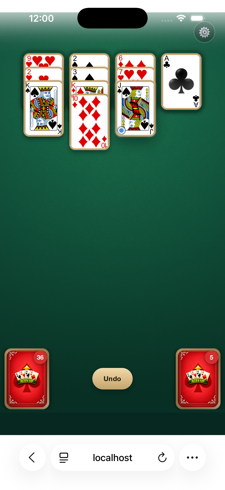
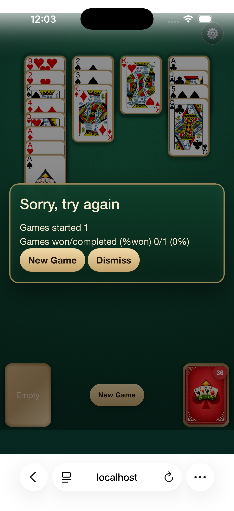
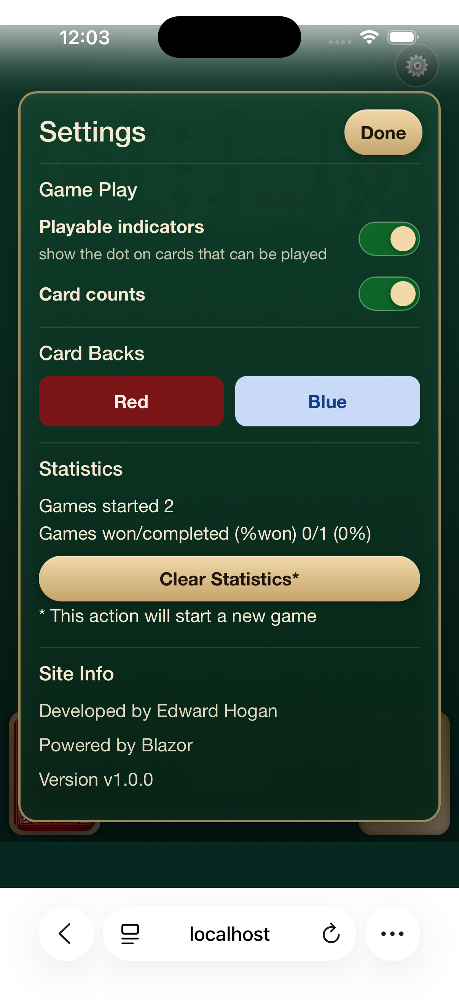

# Aces Up Game (Blazor WebAssembly)

Aces Up Solitaire implemented with **Blazor WebAssembly** (.NET 10).

This repository contains:

- `aces-up-game-blazor/`: the Blazor WebAssembly app
- `aces-up-game-blazor.Tests/`: xUnit unit tests for game logic
- `docs/`: project documentation and screenshots

## Tech Stack

- .NET 10 (`net10.0`)
- Blazor WebAssembly (`Microsoft.NET.Sdk.BlazorWebAssembly`)
- xUnit for tests

## Features

- Aces Up solitaire gameplay
- Deal, discard, relocate, and undo actions
- In-browser persisted settings and statistics
- Responsive layouts for desktop and phone screens

## Prerequisites

- .NET SDK 10.0+

Verify installation:

```bash
dotnet --version
```

## Build

From the repository root:

```bash
dotnet restore
dotnet build aces-up-game-blazor/aces-up-game-blazor.csproj
```

## Run Locally

```bash
dotnet run --project aces-up-game-blazor/aces-up-game-blazor.csproj
```

Default local URL (from launch settings):

- `http://localhost:5164`

## Run Tests

```bash
dotnet test aces-up-game-blazor.Tests/aces-up-game-blazor.Tests.csproj
```

## Publish (Production Build)

Publish the app as static WebAssembly assets:

```bash
dotnet publish aces-up-game-blazor/aces-up-game-blazor.csproj -c Release
```

Published files are generated under:

- `aces-up-game-blazor/bin/Release/net10.0/publish/wwwroot/`

Deploy the contents of that `wwwroot` folder to any static hosting provider.

## Deployment Notes

This app is a standalone Blazor WebAssembly app and can be hosted as static files on:

- GitHub Pages
- Azure Static Web Apps
- Netlify
- Cloudflare Pages
- Amazon S3 + CloudFront

### Base Path Behavior

`aces-up-game-blazor/wwwroot/index.html` includes a script that sets `<base href>` dynamically:

- `"/"` on localhost
- `"/aces-up-game-blazor/"` on non-localhost hosts

If your deployed repository or site path is different, update that non-localhost base path value accordingly.

## Screenshots

### Web


### Phone

<table>
  <tr>
    <td></td>
    <td></td>
  </tr>
  <tr>
    <td></td>
    <td></td>
  </tr>
</table>

## Project Structure

```text
aces-up-game/
  aces-up-game-blazor/          # Blazor WebAssembly app
  aces-up-game-blazor.Tests/    # Unit tests
  docs/                         # Screenshots and docs
```

## License

No license file is included yet. Add one (for example MIT) before publishing publicly if needed.
